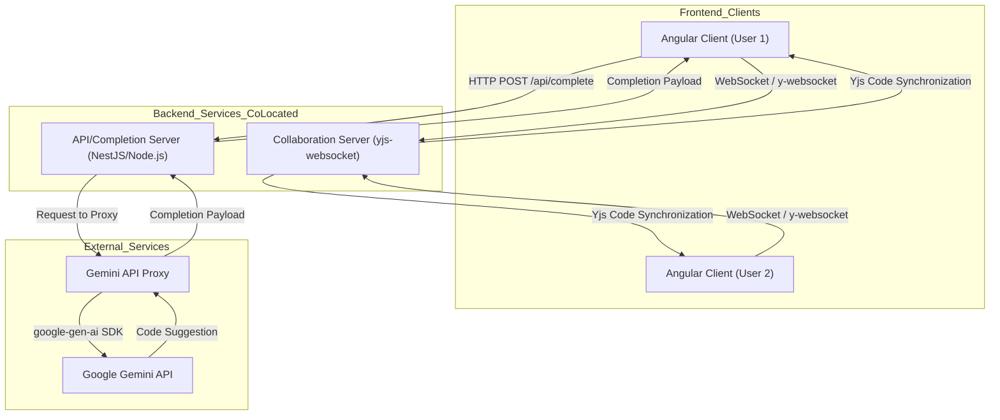

# 💻 Real-time Collaborative Code Editor with AI Completion

A robust, full-stack prototype demonstrating real-time collaborative editing and intelligent code completion powered by the Google Gemini API. This project is structured as a monorepo containing a modern Angular client and a scalable Node.js/NestJS server.

---

## 🚀 Project Structure

This repository is divided into two main components:

| Directory | Component | Primary Technologies | Description |
| :--- | :--- | :--- | :--- |
| `code-editor` | **Frontend (Client)** | Angular, CodeMirror 6, Yjs, TypeScript | The Single Page Application (SPA) providing the collaborative editing interface. |
| `code-editor-server` | **Backend (Server)** | NestJS/Node.js, WebSockets, Gemini API Proxy | The server handling real-time synchronization (Yjs Provider) and securely managing AI code completion requests. |

---

## 🛠️ Getting Started

To run this project, you need to set up both the backend and the frontend application.

### 1. Backend Setup (NestJS/Node.js Server)

For detailed setup, configuration, and instructions on obtaining the **Gemini API Key**, please refer to the dedicated Backend README:

➡️ **[View Backend Setup Instructions](./code-editor-server/README.md)**

### 2. Frontend Setup (Angular Client)

For instructions on installing dependencies, configuring environment variables, and running the Angular application, please refer to the dedicated Frontend README:

➡️ **[View Frontend Setup Instructions](./code-editor/README.md)**

---

## 🧪 How to Test the Application

Once both the [backend](./code-editor-server/README.md) and [frontend](./code-editor/README.md) are running, you can test the core features.

### 1. Testing Real-time Collaboration

1.  Start the Angular application (e.g., `http://localhost:4200`).
2.  The application will automatically set or use a room ID from the URL (e.g., `http://localhost:4200/my-session-id`).
3.  Copy the **full URL** from your browser.
4.  Open this exact same URL in a second browser tab (or an incognito window, to simulate a different user).
5.  **Test Sync:** Type in one editor. The text should appear instantly in the second editor.
6.  **Test Cursors:** Select text in one editor. The cursor position and selection of the "other" user should become visible in the first editor, powered by `y-codemirror.next`.

### 2. Testing AI Code Completion

1.  In either editor window, start writing some JavaScript code.
2.  For example, type:
    ```javascript
    function calculateTotal(items) {
      let total = 0;
    ```
3.  On the next line, trigger the autocomplete. (This might be automatic on typing, or you may need to press `Ctrl+Space`).
4.  **Verify:** You should see a completion dropdown appear, showing the AI-generated suggestion (e.g., `items.forEach(item => { ... });`).
5.  Press `Enter` to accept the suggestion.

---

## 🚀 Architecture Overview

The editor is built on a modern full-stack architecture that ensures **real-time collaboration** and **secure** AI usage.

| Component | Primary Technology | Key Purpose |
| :--- | :--- | :--- |
| **Frontend (Client)** | **Angular 20, TypeScript** | User interface, CodeMirror 6, session management. |
| **Code Editor** | **CodeMirror 6, `y-codemirror.next`** | Editor component with collaborative editing support (using Yjs). |
| **State/Sync** | **Yjs, `y-websocket`** | Handles Shared Types and Operational Transformation (OT/CRDT) synchronization logic. |
| **Backend (Server)** | **NestJS/Node.js (TypeScript)** | WebSocket Gateway, Yjs Provider server, Secure Proxy for the Gemini API. |
| **AI Completion** | **Google Gemini API (`@google/generative-ai`)** | Generates intelligent code suggestions in real-time. |

---

## 💡 AI Interaction Details

This section details how the frontend, backend, and Gemini API work together to provide code completions, based on the actual backend implementation.

### 1. Prompt Engineering (Backend)

To ensure the Gemini API returns only useful, raw code snippets, the `code-editor-server` uses a precise prompt template (`ai/prompts.ts`) and a specific configuration.

The model used is **`gemini-2.5-flash`**, optimized for speed.

**Prompt Template:**
The `AiService` constructs a prompt using the following template:

```typescript
`GENERATE ONLY CODE COMPLETION. Based on the following code context, output a single, concise code suggestion that directly completes the snippet. DO NOT include any explanations, markdown formatting, preamble, or commentary. The output must be the raw, suggested code:

Code Context:
${codeContext}`
```

### Configuration & Response Handling:

* This prompt strictly instructs the model to act as a raw completion engine, not a conversational chatbot.

* The API call is configured with **`maxOutputTokens`**: 50 to keep suggestions concise and responses fast.

* The **`AiService`** then takes the **`response.text`** from the Gemini API and runs **`.trim()`** on it, ensuring no leading/trailing whitespace.

* If the API call fails or returns no text, it gracefully returns an empty string **`("")`**.

### 2. Response Parsing & Display (Frontend)
The frontend uses the **`@codemirror/autocomplete`** package to display suggestions. A custom **`CompletionSource`** is implemented to handle the API call.

Here is the flow:

1. **Trigger:** The user types or triggers autocomplete (e.g., Ctrl+Space).
   * **Trigger Logic:** The suggestion is only attempted if the autocompletion is explicit (context.explicit is true) or if the text immediately preceding the cursor matches a word boundary (/\w+$/). If it's not explicit and there's no word in progress, it immediately returns null.

2. **Request:** The custom CompletionSource in Angular makes an HTTP request to the backend's **`POST /api/complete endpoint`**, sending the current code context before the cursor **`(state.doc.sliceString(0, pos))`**.

3. **Backend Response:** The NestJS controller receives the raw string (e.g., **`" console.log(item);\n});")`** from the **`AiService`** and wraps it in a JSON object for the frontend:

```json
{
  "suggestion": "  console.log(item);\n});"
}
```

4. **Parsing & Formatting::** The **`fetchGeminiSuggestion`** method in the **`Autocomplete`** service receives this JSON, validates the **`suggestionText`**, and transforms it into a CodeMirror `**Completion`** object:
   * **`from`**: Set to the current cursor **`position`** for insertion.
   * **`apply`**: Contains the full suggestion text (**`suggestionText`**) to be inserted.
   * **`label`**: Displays a truncated version of the suggestion (max 50 characters) in the dropdown list.
   * **`detail`** and **`info`** fields are added for better user context, indicating it is a Gemini AI completion.

```typescript
private async fetchGeminiSuggestion(
    codeContext: string,
    position: number
  ): Promise<{ from: number; options: Completion[] } | null> {
  try {
    // 1. Make the POST request to the backend proxy (NestJS)
    const response = await fetch(GEMINI_PROXY_URL, {
      method: 'POST',
      headers: { 'Content-Type': 'application/json' },
      // Send the code before the cursor as context for Gemini
      body: JSON.stringify({ codeContext }),
    });

    // 2. Handle failed response (e.g., 500 backend error)
    if (!response.ok) {
      return null;
    }

    // 3. Process the JSON response from the backend and extract the suggestion
    const data = await response.json();
    // Expects an object like { suggestion: "..." }
    const suggestionText: string = data.suggestion || '';

    // 4. If the backend returned no text (error or no suggestion), return null
      if (!suggestionText) return null;

    // 5. Construct the CodeMirror Completion object
    const suggestion: Completion = {
      // 'label': What is shown in the suggestions list. It is truncated if too long.
      label: suggestionText.length > 50 ? `${suggestionText.substring(0, 50)}...` : suggestionText,
      // Additional information shown in the interface (optional)
      detail: 'Gemini AI Completion',
      info: 'Suggestion provided by Gemini AI',
      // 'apply': The complete text that is inserted into the editor when the suggestion is selected.
      apply: suggestionText,
      // 'type': CSS class or semantic type for styling (e.g., 'keyword', 'variable')
      type: 'keyword',
    };

    // 6. Return the result in the format CodeMirror expects
    return {
      // 'from': Indicates the starting position to insert the text (the current cursor position)
      from: position,
      // 'options': An array of Completion objects (only one in this case)
      options: [suggestion],
    };
  } catch (_error) {
    // Catch network or parsing errors and return null to prevent CodeMirror from crashing
    return null;
  }
}
```

---

### Interaction Diagram


---

## ✨ Features Highlight

* **Real-time Synchronization:** Utilizes WebSockets and Yjs for seamless, character-level collaborative editing.
* **AI Code Completion:** Secure integration with the Gemini API via a backend proxy for intelligent code suggestions.
* **Collaborator Awareness:** Displays other users' cursors and selections within the CodeMirror editor.

---

## 📌 Assumptions, Simplifications, and Next Steps

This project is a functional prototype. Certain architectural and implementation decisions were made to prioritize delivery within the 1-week timeframe.

### Assumptions Made

* **Public Access:** It is assumed that any user with the correct URL, including the `roomId`, has permission to join and edit the session. No authentication or access control is implemented.
* **Browser Capability:** Users are expected to use modern browsers with robust support for WebSockets and Angular.

### Simplifications

* **No Database Persistence:** The real-time document state (Yjs documents) is held **in-memory** on the Node.js server. If the server is restarted, all existing session data and code are lost.
* **Basic AI Context:** The code completion only uses the immediate file context (`codeContext`). A more robust solution would provide file structure awareness and type definitions to the AI model.
* **Minimal Error Handling:** Error handling for external services (like Gemini API rate limiting or network failures) is basic, often resulting in a graceful lack of suggestions rather than user-facing error messages.
* **Single Document:** The prototype supports editing only one file per collaborative session.

### Potential Next Steps

1.  **Database Persistence:** Integrate a persistent storage solution (e.g., using `y-leveldb`, Redis, or PostgreSQL) to ensure document state survives server restarts.
2.  **Authentication & User Avatars:** Add a user login system (e.g., OAuth) to tie cursors and edits to named users, rather than anonymous collaborators.
3.  **File Tree/Project Management:** Implement a sidebar to allow sessions to manage multiple files within a collaborative "project."
4.  **AI Enhancement:** Improve the prompt engineering to dynamically switch language context (e.g., based on the file extension) and implement a simple caching layer in the backend proxy for popular suggestions.

---

## 👤 Author

This project is maintained by  [amfajardoo](https://github.com/amfajardoo).

[LinkedIn](https://www.linkedin.com/in/andres-fajardo-5a57ba126/)
