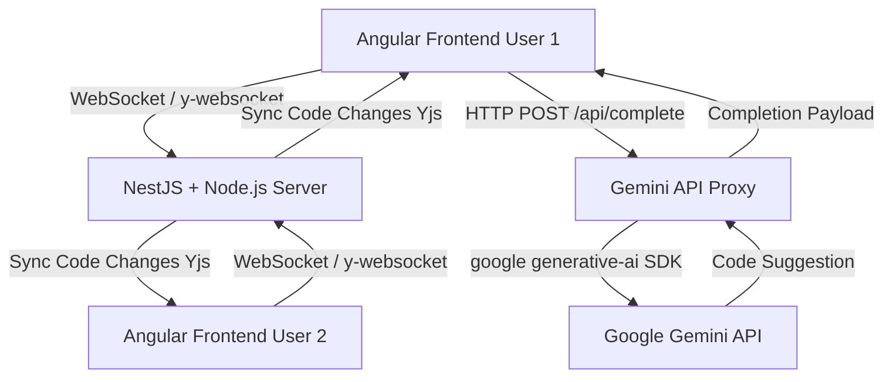

# 💻 Real-time Collaborative Code Editor with AI Completion

A robust, full-stack prototype demonstrating real-time collaborative editing and intelligent code completion powered by the Google Gemini API. This project is structured as a monorepo containing a modern Angular client and a scalable Node.js/NestJS server.

---

## 🚀 Project Structure

This repository is divided into two main components:

| Directory | Component | Primary Technologies | Description |
| :--- | :--- | :--- | :--- |
| `code-editor` | **Frontend (Client)** | Angular, CodeMirror 6, Yjs, TypeScript | The Single Page Application (SPA) providing the collaborative editing interface. |
| `code-editor-server` | **Backend (Server)** | NestJS/Node.js, WebSockets, Gemini API Proxy | The server handling real-time synchronization (Yjs Provider) and securely managing AI code completion requests. |

---

## 🛠️ Getting Started

To run this project, you need to set up both the backend and the frontend application.

### 1. Backend Setup (NestJS/Node.js Server)

For detailed setup, configuration, and instructions on obtaining the **Gemini API Key**, please refer to the dedicated Backend README:

➡️ **[View Backend Setup Instructions](./code-editor-server/README.md)**

### 2. Frontend Setup (Angular Client)

For instructions on installing dependencies, configuring environment variables, and running the Angular application, please refer to the dedicated Frontend README:

➡️ **[View Frontend Setup Instructions](./code-editor/README.md)**

---

## 🚀 Architecture Overview

The editor is built on a modern full-stack architecture that ensures **real-time collaboration** and **secure** AI usage.

| Component | Primary Technology | Key Purpose |
| :--- | :--- | :--- |
| **Frontend (Client)** | **Angular 17+, TypeScript** | User interface, CodeMirror 6, session management. |
| **Code Editor** | **CodeMirror 6, `y-codemirror.next`** | Editor component with collaborative editing support (using Yjs). |
| **State/Sync** | **Yjs, `y-websocket`** | Handles Shared Types and Operational Transformation (OT/CRDT) synchronization logic. |
| **Backend (Server)** | **NestJS/Node.js (TypeScript)** | WebSocket Gateway, Yjs Provider server, Secure Proxy for the Gemini API. |
| **AI Completion** | **Google Gemini API (`@google/generative-ai`)** | Generates intelligent code suggestions in real-time. |

### Interaction Diagram

## ✨ Features Highlight

* **Real-time Synchronization:** Utilizes WebSockets and Yjs for seamless, character-level collaborative editing.
* **AI Code Completion:** Secure integration with the Gemini API via a backend proxy for intelligent code suggestions.
* **Collaborator Awareness:** Displays other users' cursors and selections within the CodeMirror editor.

---

## 🧪 Testing & Architecture

* **Architecture Overview:** The high-level architecture explaining the communication between Angular, NestJS, and Gemini API is detailed in the **[Backend README](./code-editor-server/README.md)**.
* **Testing Features:** Instructions on how to test collaborative editing and AI completion are provided in the **[Frontend README](./code-editor/README.md)**.

---

## 👤 Author

[Andres M. Fajardo] - [LinkedIn](https://www.linkedin.com/in/andres-fajardo-5a57ba126/)
